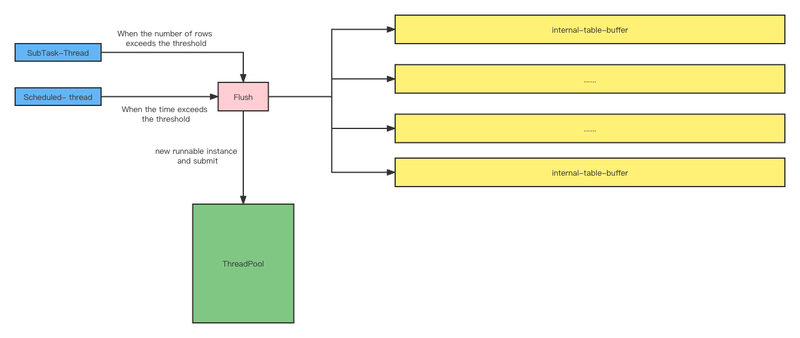

## Mysql to Mysql realtime data-sync base on Flink Cdc

### 原理



```java
// 淦，好久没画图了，已经不知道怎么画比较合适了
```

图中不同的颜色表示不同的角色：

* 蓝色：表示任务提交者
  * `SubTask-Thread`：执行Flink SubTask的线程，调用`invoke`方法，在方法中检查某个Table的Buffer Queue是否超过阈值，如果超过则创建`Runnable`实例提交到线程池，进行Flush
  * `Scheduled-thread`：定时调度的线程，按指定的时间间隔，为**所有有元素的**Table Buffer Queue创建`Runnable`实例并提交到线程池Flush，无元素的Buffer Queue不会生成`Runnable`实例
* 粉色：Flush方法，实现了具体写入外部数据库的逻辑
* 绿色：执行Flush Task的线程池
* 黄色：缓冲Table DDL与DML消息的Queue，每个Table有各自的Queue

#### 并发与线程同步

并发：

* Table之间是并发的，并且相互之间完全无影响（因为Buffer Queue是独立的）
* 同一个Table的不同Flush策略是并发的，因为线程安全问题（Flush同一个Buffer Queue），并发线程之间需要争抢同一把锁

同步：

* Buffer Queue的读写是多线程的，写操作在`SubTask-Thread`线程中，读操作在执行`Flush`方法的线程中，线程安全由阻塞队列保证
* 同一个表会有多个`Runnable`实例去调用Flush方法，对同一个表来说，Flush方法一定是要串行的（防止后到的数据先执行）。为每个表设置一个锁，对该表进行Flush的线程首先需要拿到锁，以此保证对同一个表的Flush操作是串行的

### 优势与特性

* 原生支持PolarDB MySQL
  
  详见`https://ververica.github.io/flink-cdc-connectors/master/content/about.html#supported-connectors`
  
* 简化部署，减少资源占用

  使用Debezium做CDC需要部署Kafka集群和Kafka Connect集群，需要部署生产者（Debezium）和消费者（Flink Job）两个应用，使用Flink CDC无需部署Kafka，只需要一个应用（Flink Job）即可

* 消息格式定制化

  自定义`DebeziumDeserializationSchema`

* 幂等写入
  ```sql
  INSERT .. ON DUPLICATE KEY UPDATE ..
  ```

* 微批写入

  与Flink Jdbc Connector Sink行为一致，内部缓存的数据**条数超过阈值**或者**时间超过阈值**，则Flush。为了提高批量写入的性能，Mysql Url需要添加`rewriteBatchedStatements=true`参数

* 并发写入

  多线程并发写入数据库，每次Flush由一个线程负责一个Table，Table之间互不影响。这样设计的意义有两点：

  1. 表与表之间解耦，当一个表在目标库执行长时间事务或者DDL时，不会影响其他表的数据同步
  2. 提高吞吐量

* 自动创建目标表

  当新增同步表时，无需手动创建目标表

* 处理删除和清空

  将`Delete`和`Truncate`操作转换为更新逻辑删除字段

* 完美处理时间类型

  可支持纳秒级别的时间同步

* 动态增减表

* 支持`Schema evolution`

  可直接拿到源库DDL变更语句，更简洁优雅地处理Schema变更。可处理各种五花八门的DDL语句，包括：

  * `Column add/drop/modify`
  * `Regular Key/Index add/drop/modify`
  * `Unique/Primary Key add/drop/modify`
  * `Drop table`
  * `Truncate`
  * ...

### How to use

```java
// todo
```

### Todo

### To be resolved

1. `end to end exactly-once`
   
   如果想完美处理DDL（保证端到端的精准一次），需要Flink框架层面的支持，用户层面无法**完美**处理DDL。因为DDL语句不具备幂等性质，且MySQL的DDL语句是无事务的，所以无法保证端到端的精准一次

2. 数据倾斜

   源表更新频率不同会导致数据倾斜
   根据唯一键字段或主键字段将消息相对地均匀分发到下游算子，以此缓解数据倾斜

   1. 如果同时存在唯一键和主键，优先使用唯一键
   2. 如果唯一键和主键都没有，则该表所有数据都发送到subtask-0处理
   
   此方案处理DDL时可能有数据一致性问题，并且端到端精准一次同样很难保证，还需要考虑唯一键字段为null的情况

3. 支持更多的`Schema evolution`

   * 支持`Table/Schema name`变更

     目前的实现中，不同表的消息按照`Schema.Table`格式的唯一标识符放入不同的队列中，当出现`Table/Schema rname`的操作时，收到消息中的`db\table`字段已经是更新后的了，所以再根据消息字段生成的唯一标识符无法放到该表所在的队列中去

4. 动态修改配置

   使用广播流或者集成`Nacos`

5. 配置Json化

   启动Json时，传入Json字符串或者文件，类似Kafka Connect的方式，避免代码中硬编码

6. 支持写入`Hudi`

7. 消息复用

   支持双写到MySQL和Kafka，既可以满足Cdc场景，其它实时作业又可以从Kafka复用Cdc消息

8. 完善日志

9. 集成钉钉报警